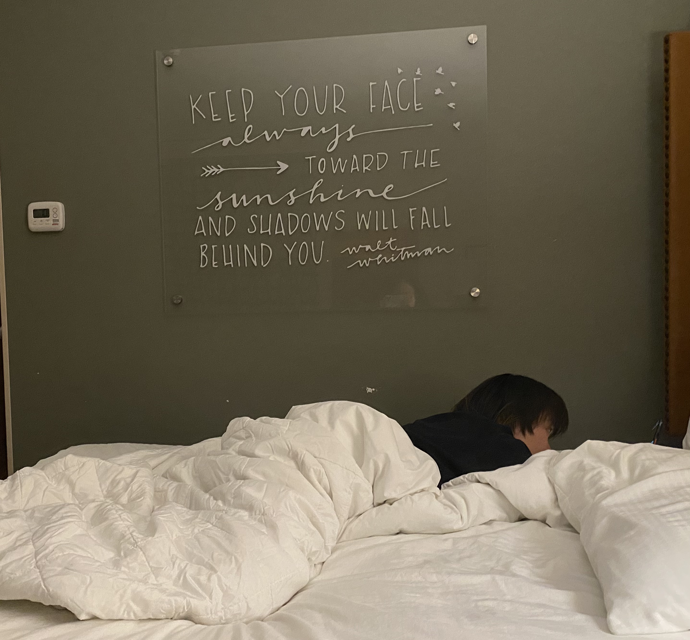
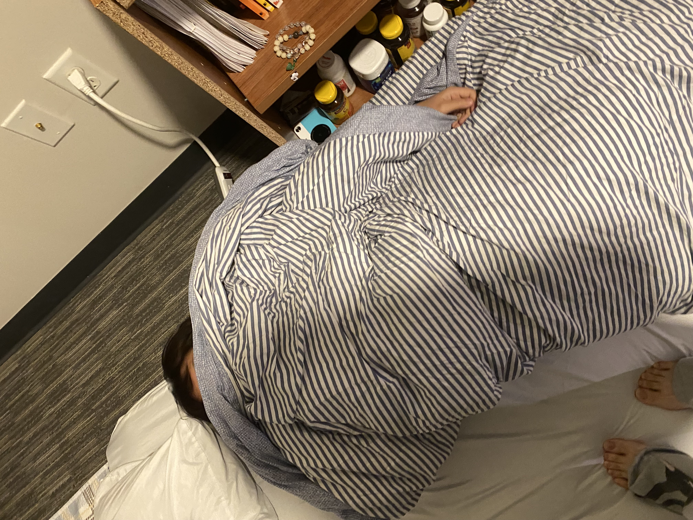
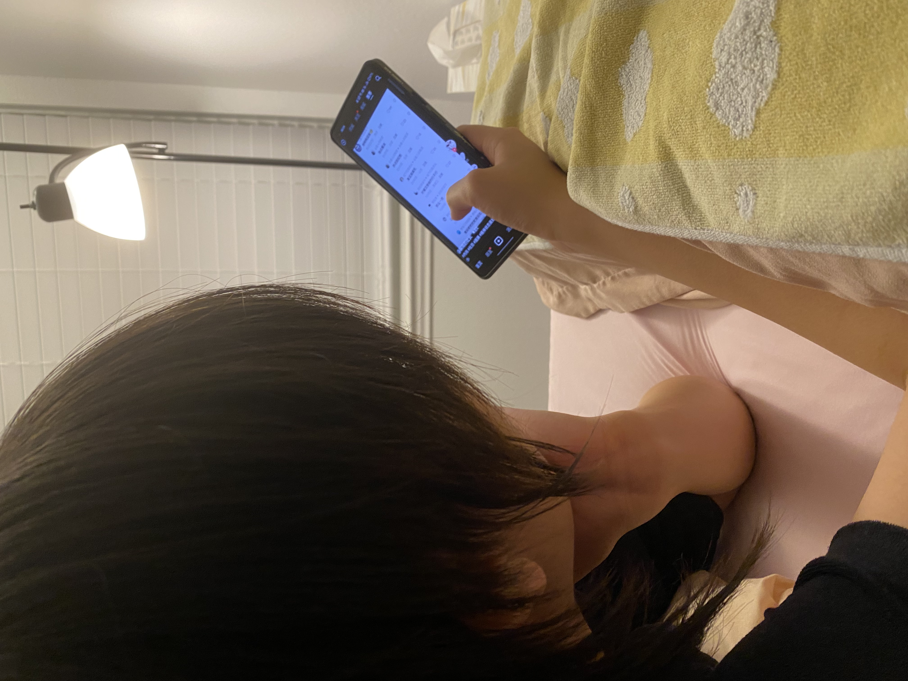
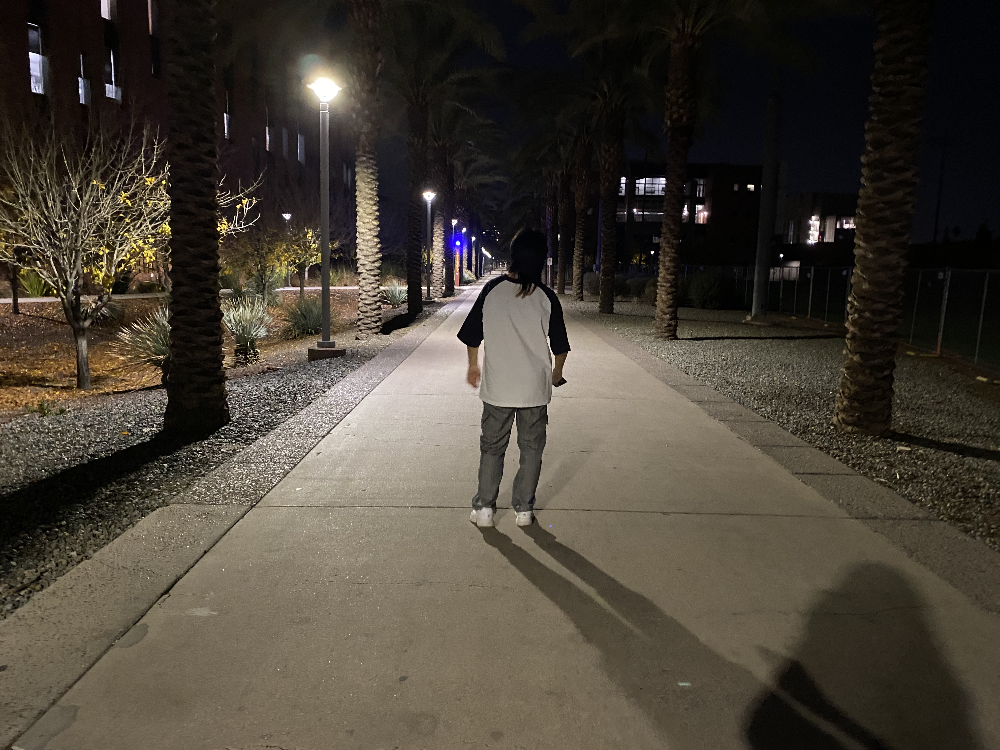
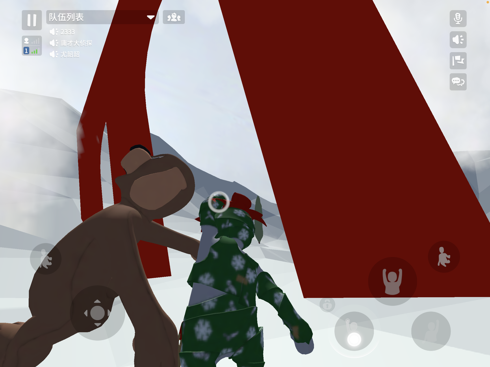
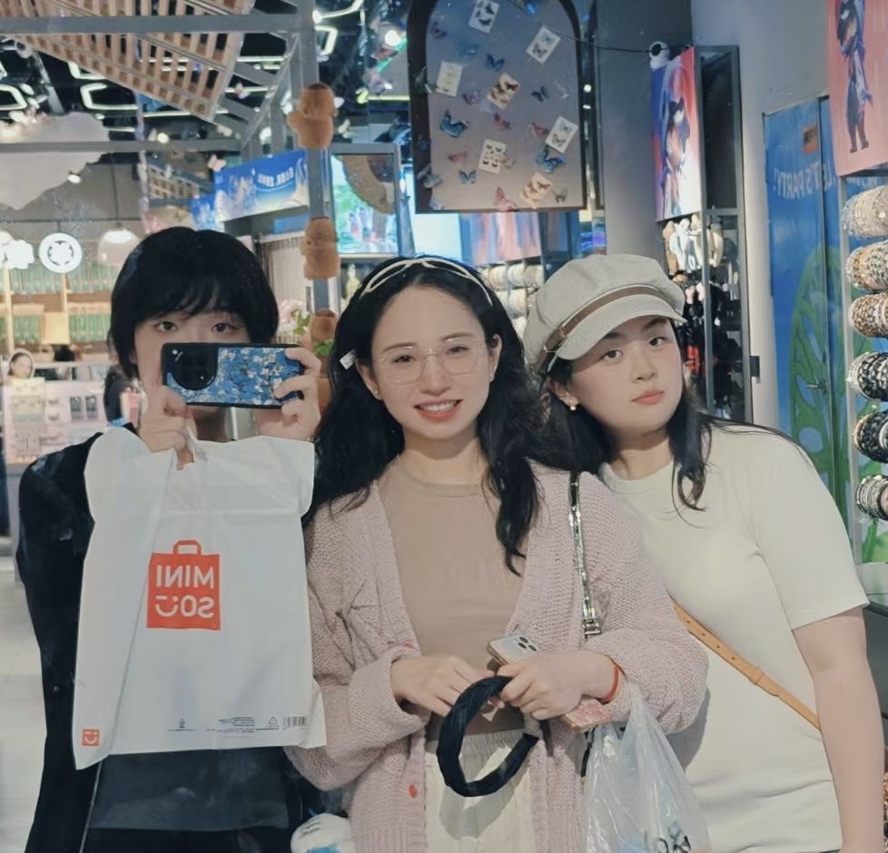
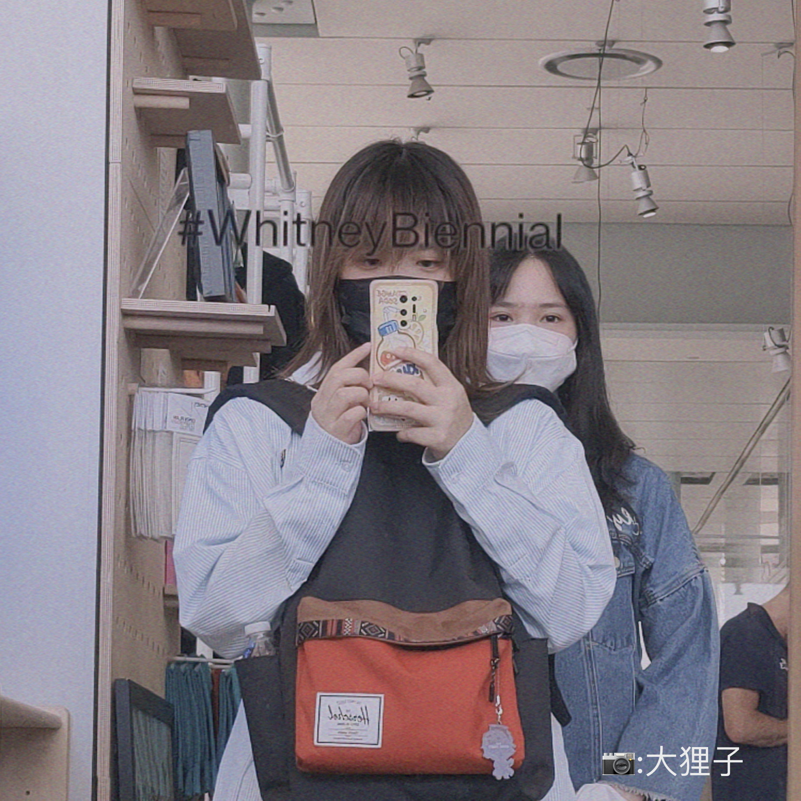

<!-- 温馨·简洁样式（不依赖外部字体，适配手机/平板/桌面） -->

&nbsp;

## ✨🌠 COOL
<figure class="hero card">
  
  <figcaption> COOL✨</figcaption>
</figure>

## 春 卷

  <figure class="card">
    
    <figcaption>裹</figcaption>
  </figure>
  <figure class="card">
    
    <figcaption>裹裹</figcaption>
  </figure>
  <figure class="card">
    
    <figcaption>裹裹裹</figcaption>
  </figure>
  <figure class="card">
    
    <figcaption>裹裹裹裹</figcaption>
  </figure>
  <figure class="card">
    
    <figcaption>在干嘛</figcaption>
  </figure>

## “背 影”

  <figure class="card">
    
    <figcaption>Hello</figcaption>
  </figure>
  <figure class="card">
    
    <figcaption>又在干嘛</figcaption>
  </figure>

## 揪住臭狸子
<figure class="hero card">
  
  <figcaption>抓到一只大狸子</figcaption>
</figure>

## 🤍啦啦啦!

  <figure class="card">
    
    <figcaption>🎉</figcaption>
  </figure>
  <figure class="card">
    
    <figcaption>🎈</figcaption>
  </figure>
  <figure class="card">
    
    <figcaption>👻</figcaption>
  </figure>

<a class="back-top" href="index.html">← 返回 Birthday 首页</a>
