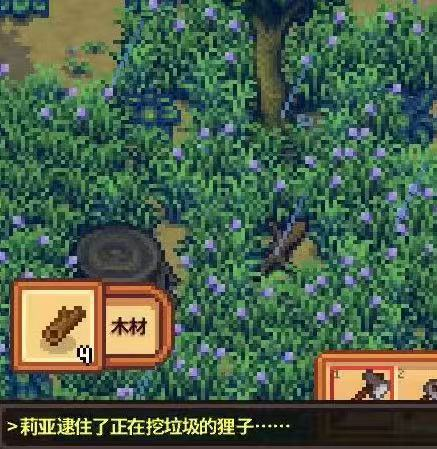

<!-- 温馨·简洁样式（不依赖外部字体，适配手机/平板/桌面） -->

&nbsp;

## ✨COOL {.center-title .cn-rounded}
<figure class="hero card">
  
  <figcaption> COOL✨</figcaption>
</figure>

## 春 卷 {.center-title .cute-roundstack}

  <figure class="card">
    
    <figcaption>裹</figcaption>
  </figure>
  <figure class="card">
    
    <figcaption>裹裹</figcaption>
  </figure>
  <figure class="card">
    
    <figcaption>裹裹裹</figcaption>
  </figure>
  <figure class="card">
    
    <figcaption>裹裹裹裹</figcaption>
  </figure>
  <figure class="card">
    
    <figcaption>在干嘛</figcaption>
  </figure>
  <figure class="card">
    
    <figcaption>呃</figcaption>
  </figure>

## “背 影” {.center-title .cute-roundstack}

  <figure class="card">
    
    <figcaption>Hello</figcaption>
  </figure>
  <figure class="card">
    
    <figcaption>又在干嘛</figcaption>
  </figure>

  🍓
  🍑
  🍰

## 揪住臭狸子 {.center-title .cute-roundstack}
<figure class="hero card">
  
  <figcaption>抓到一只大狸子</figcaption>
</figure>

## Hi👋 {.cute-roundstack}
<figure class="hero card" style="max-width:250px; margin:auto;">
  
  <figcaption>🫡</figcaption>
</figure>

## 🤍啦啦啦! {.center-title .cute-roundstack}

  <figure class="card">
    
    <figcaption>🎉</figcaption>
  </figure>
  <figure class="card">
    
    <figcaption>🎈</figcaption>
  </figure>
  <figure class="card">
    
    <figcaption>👻</figcaption>
  </figure>
  <figure class="card">
    
    <figcaption>🐱</figcaption>
  </figure>
  <figure class="card">
    
    <figcaption>某种神秘仪式🕯️</figcaption>
  </figure>
  <figure class="card">
    
    <figcaption>🌈</figcaption>
  </figure>

## 第五人格启动！{.center-title .cute-roundstack}
<figure class="hero card" style="max-width:500px; margin:auto;">
  
  <figcaption>
  山林不需向四季起誓，荣枯随缘  
  海洋不需对沙岸承诺，遇合尽兴
  </figcaption>
</figure>

## 星露谷启动! {.center-title .cute-roundstack}

  <figure class="card">
    
    <figcaption>💫</figcaption>
  </figure>
  <figure class="card">
    
    <figcaption>🎣</figcaption>
  </figure>
  <figure class="card">
    
    <figcaption>🏡</figcaption>
  </figure>
  <figure class="card">
    
    <figcaption></figcaption>
  </figure>
  <figure class="card">
  
  <figcaption>️</figcaption>
  </figure>
  <figure class="card">
  
  <figcaption></figcaption>
</figure>

 “愿岁并谢 与长友兮” 

<a class="back-top" href="index.html">← 返回 Birthday 首页</a>

<!-- 固定浮标：回到顶部 -->
<a class="fab" href="#top" title="回到顶部">↑</a>